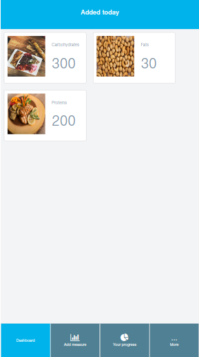

<h3 align="center">Diet tracking app</h3>

Diet tracking app is a full stack project, which includes manipulating dynamically the Virtual DOM and, use States and Props (useState Hook) and useEffect Hook to change the information accordingly with the user interactions. All data are retrieved from the Rails backend API and the information kept on a Redux store available on all application components. To secure the backend API, I use Doorkeeper. In order to test the React Components, I use Jest and React Testing Library. The Rails API is tested using RSpec. Built with React, JavaScript, Rails, HTML5, CSS3, Bootstrap, Redux and Prop-types.

## App Screenshot

## Live Link Demo

[Diet tracking app](https://marcelomaidden-diet-tracker.herokuapp.com/)

## Built With

- React
- HTML5
- CSS3
- Bootstrap
- JavaScript
- Jest
- React Testing Library
- Redux
- Redux thunk
- Rails
- Doorkeeper
- RSpec

## Getting Started

To get a local copy up and running follow these simple example steps.

### Prerequisites

- Text Editor (VSCode is suggested.)

### Setup

- Install [git](https://git-scm.com/downloads)
- Open Terminal
- Change directory to folder to download repository
- Use `cd <file-path>`
- Run `git clone https://github.com/marcelomaidden/diet_tracker`
- Enter the project's folder `cd diet_tracker`
- Run `bundle install`
- Run `npm install`

## Generate Doorkeeper application client_id and client_secret
- Enter the command `rails c` in your terminal
- Type `Doorkeeper::Application.create(name: "Diet tracking app", redirect_uri: "", scopes: "")`
- Copy uid and secret generated after typing the command above
- In development environment add the environment variables in config/initializer/webpack/development.js like so:
`process.env.REACT_APP_CLIENT_ID = "uid generated above"`
`process.env.REACT_APP_CLIENT_SECRET = "secret generated above"`

To make any change,

- Open related file by using text editor.

## Usage
  - Run `rails s` on your terminal to open the server automatically on your browser
  - If it doesn't open automatically go to your browser and type the url `http://localhost:3000`

## Test if the API is working
- Got to `http://localhost:3000/sign-up`
- Create an user
- In your terminal type the command
`curl -X POST -d "email=your_user_email" -d "password=your_user_password" -d "grant_type=password" -d "client_id=uid" -d "client_secret=secret" http://localhost:3000/oauth/token`
- Change `your_user_email` and `your_user_password` to your user information
- Change `uid` and `secret` for the ones generated by Doorkeeper

## Test
  - Run `npm run test` to perform unit tests, also tests if React components are being correctly rendered;
  - Run `rspec --format doc` to perform test on the Rails API
   
## Author

👤  **Marcelo Fernandes**

- GitHub: [@marcelomaidden](https://github.com/marcelomaidden)
- Twitter: [@marcelomaidden](https://twitter.com/marcelomaidden)
- LinkedIn: [Marcelo Fernandes](https://linkedin.com/in/marcelofernandesdearaujo) 
## 🤝 Contributing

Contributions, issues and feature requests are welcome! Start by:

- Forking the project
- Cloning the project to your local machine
- `cd` into the project directory
- Run `git checkout -b your-branch-name`
- Make your contributions
- Push your branch up to your forked repository
- Open a Pull Request with a detailed description to the development branch of the original project for a review

## Show your support

Give a ⭐️ if you like this project!

## Acknowledgments

- React
- Bootstrap
- W3Schools
- Font Awesome
- Javascript
- Jest
- React Testing Library
- Redux
- Redux-thunk
- Rails
- Doorkeeper
- Unsplash
- [@sigmund](https://unsplash.com/@sigmund) - Unsplash (Carbohydrate photo)
- [@tempestdesigner](https://unsplash.com/@tempestdesigner) - Unsplash (Protein photo)
- [@enginakyurt](https://unsplash.com/@enginakyurt) - Unsplash (Fat photo)
- [Deposit photos](https://br.depositphotos.com/) - (profile photo)

## 📝 License

This project is [MIT](LICENSE) licensed.
